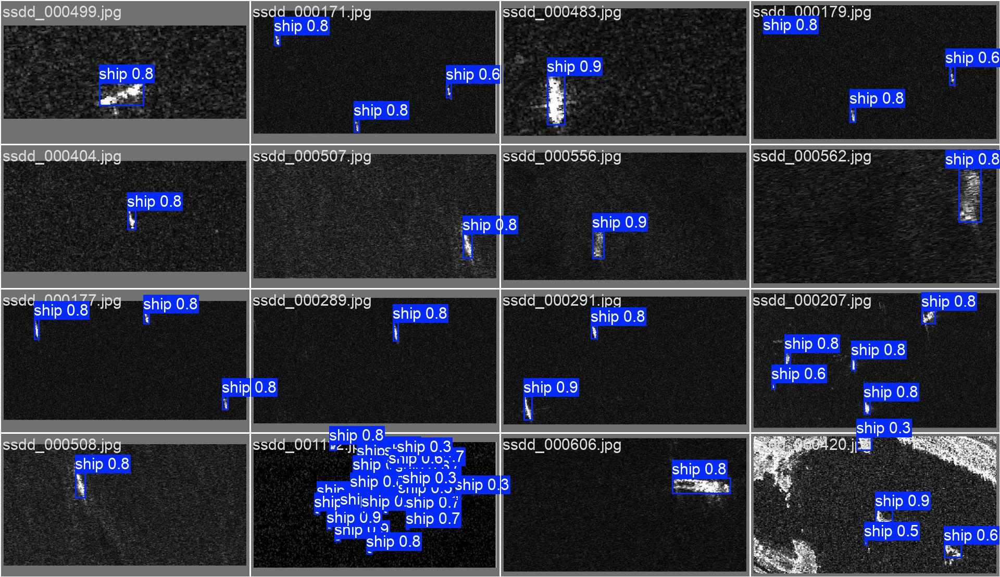
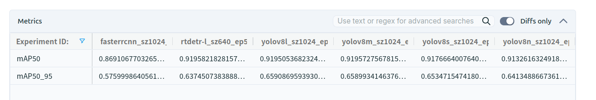
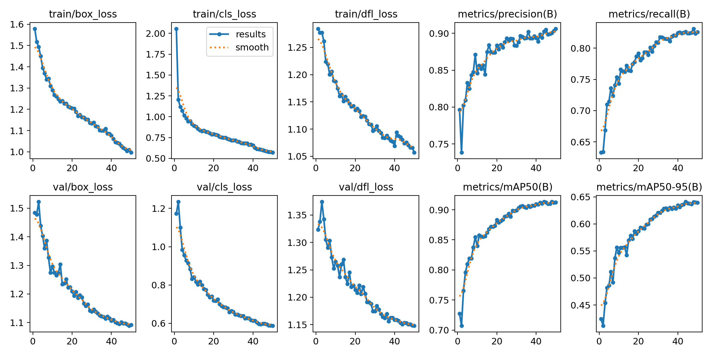
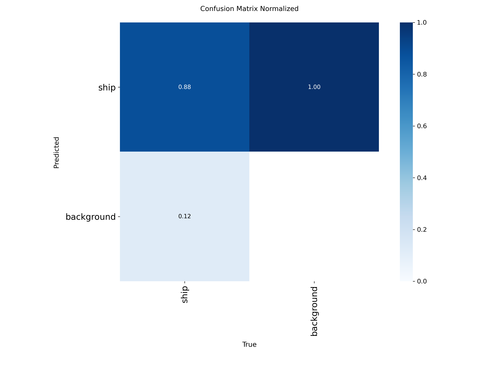

# SAR Ship Detection — MLOps Model Comparison

Comparing object detection architectures on synthetic aperture radar (SAR) satellite imagery, with experiment tracking via MLFlow on DagsHub. The central goal is not just to train models, but to demonstrate how MLFlow makes multi-framework comparisons systematic and reproducible.

**[Live experiment dashboard →](https://dagshub.com/t-pegors/sar-object-detection.mlflow)**

---

## Dataset

**Combined SAR Ship Detection Dataset** — 11,852 images (9,481 train / 2,371 val)

SAR imagery presents a harder detection problem than standard RGB photography. The sensor measures microwave backscatter, not visible light — ships appear as bright high-backscatter regions against a speckled sea background. The key challenge: **ships are tiny**. Median ship size is ~25×25 px in a 1024×1024 image, placing nearly all detections in the COCO "small object" category (area < 32² px).


*YOLOv8n detecting ships in SAR imagery. Each predicted box is a ship. The images are SAR pseudo-color — not natural photographs.*

---

## Models Compared

Three detection architectures representing fundamentally different design philosophies:

### YOLOv8 (n / s / m / l)
**Single-stage, anchor-free.** One forward pass produces all detections. The anchor-free design (predicting distances to box edges rather than offsets from predefined anchors) removes a major hyperparameter. Four scale variants (nano through large) share identical architecture — only depth and width multipliers change — making them a clean ablation on model capacity.

**Key learning:** mAP50 plateaus completely at YOLOv8m (+0.7% from n→l at 7.4× inference cost). The bottleneck is the inherent difficulty of detecting ~25px ships, not model capacity. YOLOv8n is Pareto-optimal for this dataset.

### RT-DETR-L
**Transformer-based, NMS-free.** Hybrid CNN+transformer: a HGNetv2 backbone extracts features, then a transformer encoder (AIFI) applies global self-attention at the coarsest feature scale, allowing the model to reason about the whole scene simultaneously. Detection predictions are matched to ground truth via Hungarian algorithm during training, eliminating the non-maximum suppression post-processing step entirely.

**Key learning:** NMS-free detection measurably improves recall on dense ship scenes (+2.4pp over the best YOLO variant). When ships are tightly packed, NMS suppresses valid nearby detections — bipartite matching avoids this entirely.

### Faster R-CNN (ResNet-50 FPN)
**Two-stage, anchor-based.** Stage 1 (Region Proposal Network) generates candidate regions; stage 2 classifies and refines them with ROI Align. Implemented directly in PyTorch via torchvision — no framework wrapper — requiring a custom training loop, COCO evaluator, LR scheduler, and all MLFlow logging by hand. This makes it the most instructive model to build: it shows exactly what libraries like Ultralytics abstract away.

**Critical tuning:** The default anchor sizes (32–512px) are larger than most of our ships. Custom anchors down to 8px were required to match YOLO's recall on sub-32px ships.

**Key learning:** Two-stage ROI Align produces better-localized boxes than YOLO's direct regression. Faster R-CNN achieves the highest mAP50-95 of any model (0.576), meaning the boxes it draws are more precisely fitted — at roughly 10× the inference cost.

---

## Results

| Model | mAP50 | mAP50-95 | Recall | Inference | Notes |
|-------|-------|----------|--------|-----------|-------|
| YOLOv8n | 0.913 | 0.644 | 0.826 | **4.9ms** | Pareto-optimal |
| YOLOv8s | 0.918 | 0.656 | 0.837 | 10.2ms | |
| YOLOv8m | **0.920** | 0.662 | 0.833 | 22.1ms | Plateau starts here |
| YOLOv8l | **0.920** | 0.663 | 0.829 | 36.3ms | No gain over m |
| RT-DETR-L | **0.920** | 0.637 | **0.861** | 6.9ms | 640px; best recall |
| Faster R-CNN | 0.870 | **0.576** | — | 49.5ms | Best localization |



All runs at 1024px except RT-DETR-L (640px baseline). All metrics from 50-epoch runs on the same validation split.


*YOLOv8n training metrics over 50 epochs, as logged to MLFlow. mAP50 converges around epoch 30.*

---

## MLFlow as the Comparison Engine

Every run — regardless of framework — logs to the same DagsHub MLFlow experiment. This required some non-trivial integration work:

- **Ultralytics:** The built-in MLFlow integration had to be disabled (`ultralytics_settings.update({"mlflow": False})`); custom callbacks stream per-epoch metrics with `step=epoch` for time-series charts
- **torchvision:** No MLFlow integration exists; the entire custom training loop calls `mlflow.log_metrics()` directly at each epoch
- **Resume support:** Both frameworks persist the MLFlow `run_id` to disk on run start; interrupted runs reopen the same run with `mlflow.start_run(run_id=saved_id)` so metrics continue on the same chart

This means a single DagsHub view shows all six runs side-by-side with consistent metric names, making the architectural tradeoffs immediately visible.


*Normalized confusion matrix for YOLOv8n. The high background→background and ship→ship scores reflect good discrimination, though the model does produce some false positives on sea clutter.*

---

## Repository Structure

```
src/
  train.py              single entry point for all models
  data/
    preprocess.py       YOLO labels → COCO JSON + dataset.yaml
  models/
    faster_rcnn.py      full torchvision training loop
  utils/
    mlflow_utils.py     setup_mlflow(), log_system_info()
    backfill_speed.py   retroactively log inference speed to existing runs
notebooks/
  01_eda_ssdd.ipynb     dataset EDA: image viewer, bbox stats, intensity analysis
docs/
  models.md             detailed architecture reference for all models
data/                   DVC-tracked, stored on S3
runs/                   training outputs, gitignored
```

## Running

```bash
# Environment
source .env && export PYTHONPATH=$(pwd)

# Train
./train.sh --model yolov8n --epochs 50 --imgsz 1024 --batch 8
./train.sh --model rtdetr-l --epochs 50 --imgsz 640  --batch 8
./train.sh --model fasterrcnn --epochs 50 --imgsz 1024 --batch 4

# Resume interrupted run
./train.sh --resume                             # most recent
./train.sh --resume yolov8n_sz1024_ep50_0309_0912
```

Requires: Python 3.12, CUDA 12.8+, PyTorch 2.6+ (Blackwell GPU), credentials in `.env`.

---

## Phase Roadmap

- [x] Phase 1: Environment, data pipeline, DVC, first MLFlow run
- [x] Phase 2: Model comparison — YOLOv8 n/s/m/l, RT-DETR-L, Faster R-CNN
- [ ] Phase 3: MLOps hardening — MLproject, Docker, CI
- [ ] Phase 4: Segmentation — YOLOv8-seg, Mask R-CNN
